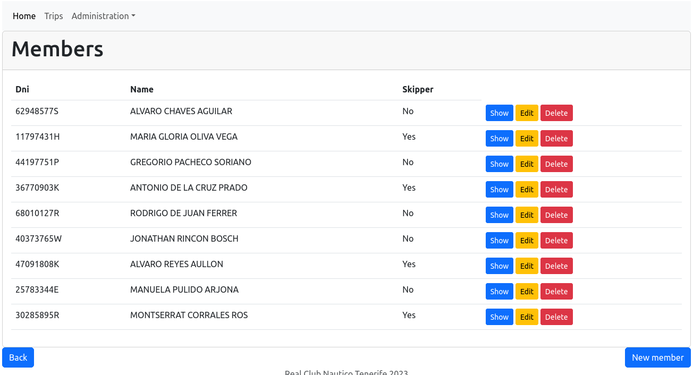

# Nautical Club Web Application

This is a comprehensive web application for managing various aspects of a 
nautical club, including boats, members, skippers, boat trips, and more. 
The project utilizes the [Spring](https://spring.io/) Framework for 
[Java](https://www.java.com/en/) web development.

## Table of Contents

1. [Technologies Used](#technologies-used)
2. [Features](#features)
3. [Getting Started](#getting-started)
4. [License](#license)

## Technologies Used

- Java
- Spring Framework (Spring Boot)
- Model-View-Controller arquitecture
- Hibernate
- Thymeleaf
- HTML/CSS
- Maven

## Features

- **Boat Management**: Create, edit, list, show, and delete boats. Record boat details such as registration information and specifications.

- **Member Management**: Maintain a database of club members, including their personal details and membership status.

- **Skipper Registration**: Allow members to register as skippers and specify their qualifications and availability for boat trips.

- **Boat Trip Scheduling**: Schedule and manage boat trips, assigning skippers and members to available boats.

## Getting Started

To run this project locally, follow these steps:

1. Clone the repository
2. Open the project on a Java IDE
3. Build and run the project
4. Access the application in your web browser: http://localhost:8080/

## License

This project is licensed under the [MIT License](LICENSE).
